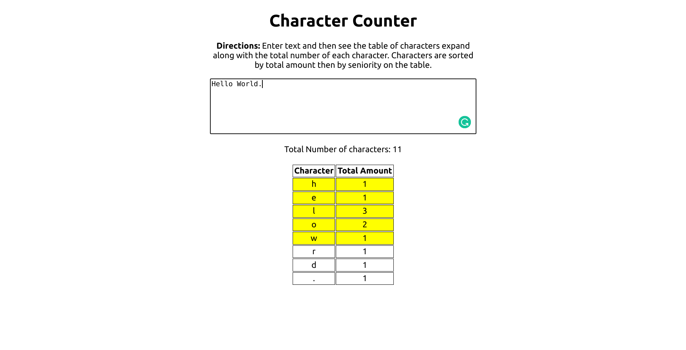

# ACHeater-Tracker

## Table of Contents
* Project
* Installation
* How it Works
* Results
* Improvements
* Code Review/Documentation


## Project
Currently, the HVAC system is set such that the air-conditioning system is turned on when the outdoor temperature is over 75 degrees Fahrenheit. Similarly, the heating system is turned on when the outdoor temperature is under 62 degrees Fahrenheit. The engineering directors want to learn how often the air-conditioning and heating systems were turned on for July 2020. In particular, they would like a summary of data that provides the following:

* For each day in the given date range, indicate whether the air-conditioning
system was turned on at least once.
* For each day in the given date range, indicate whether the heating system was
turned on at least once.

Create a Restful API with the following specifications:
* Fetch data for a month indicated by the web report
* Transform data
* Return JSON formatted data
* (Optional) Present the results in a UI

## Installation

* Built using NodeJS and ExpressJS as the backend
* ReactJS used for the UI
* The project is deployed and live through Heroku located at this link https://acheater-reporter.herokuapp.com/
* (optional) Add JSON formatter extension to browser: https://chrome.google.com/webstore/detail/json-formatter/bcjindcccaagfpapjjmafapmmgkkhgoa

## How It Works

1. Download through git clone (then run "npm install" and "npm start" and go to localhost:3001 to view app) or visit https://acheater-reporter.herokuapp.com/

<div align="center"></div>

2. Once page finishes loading enter dates in format "MM/DD/YYYY" within the data given (06/01/2020-07/30/2020)

3. Click "Output JSON File" button which then displays JSON data

    * Data is formatted as dates and whether the ac/heater was turned on at least once. 
        * '0' means false the ac/heater was not turned on at least once for that day and '1' means true the ac/heater was turned on at least once for that day.
    * To download the data right click and choose save as which will allow you to save JSON data.

<div align="center"></div>

4. Now Click the back button on the browser which brings you back to the main form. Then click the button "Show UI" which will present:

    * The amount of days the heater or ac was turned on at least once between the dates
    * The amount of days the heater and ac was turned on at least once between the dates
    * The dates included with 
        * whether the ac/heater was turned on at least once '0' = false , '1' = true

<div align="center"></div>

5. Thats how my project works! Here are some bug fixes I did to prevent the user from breaking the software:

    * Error popup if your dates are not formatted as "MM/DD/YYYY" (Tells you to retry)
    * Error popup if your startdate is after enddate (Tells you to retry)
    * Error popup if your dates do not include "06/01/2020" to "07/30/2020" (Tells you to retry)

6. Additional Information: 

If you enter a date such as "05/29/2020" to "06/20/2020" it will return 
* data between "06/01/2020" to "06/20/2020". 
    
Same thing if you have dates such as "07/29/2020" to "08/20/2020" it will return 
* data between "07/29/2020" to "07/30/2020".
    
If this feature is not wanted from the project manager this can be changed and could be easily fixed.

## Ways to Improve

* Fix the design in react making it more appealing to the eyes
* Format reactjs code better by adding more components
* Fixing it so the UI shows up right away and the JSON data lets you download through a popup

## Review Code/Documentation

    Excercise1
    ├── Client          # contains the reactjs code/modules
    |    ├── build          # build folder for deploying to heroku
    |    ├── node_modules   # 
    |    ├── public         # 
    |    ├── src                # contains app.js and weather.js and css files for reactjs
    |       ├── weather.js      # contains the weather component which contains the design
    |       ├── app.js          # weather component is pushed to app.js which is then displayed
    ├── node_modules         
    └── server          #contains the index.js which is the nodejs backend server (this is where the data manipulation is happening)                
    |    ├── index.js        #nodejs file which feeds data after manipulation to weather.js
    └── history_data_hourly.csv     #Contains the data to feed to index.js             
        
### Data -> JSON and manipulation

<details open>
<summary>Click to see script! (description of purpose below)</summary>
   
```js           
let workbook = XLSX.readFile(weatherdata_csv, {raw:true});

// read first sheet (identified by first of SheetNames)
let sheet = workbook.Sheets[workbook.SheetNames[0]];
// convert to JSON
var weatherdata_parsed = XLSX.utils.sheet_to_json(sheet);

// Grabs weatherdata_parsed.json and removes the spaces in the keys
weatherdata_parsed = JSON.parse(JSON.stringify(weatherdata_parsed).replace(/\s(?=\w+":)/g, ""));

// Initialises two variables passdata and result to pass into other portions of project
var passdata = [];
var result = {};

// Following Script transforms the data to a json file with the date and whether the 
// ac or heater was turned on at least once (0 = not turned on at least once)
// (1 = turned on at least once)
var heater_counter = 0;
var ac_counter = 0;

// clock determines when to switch between dates (once clock hits 24, 0-23)
var clock = 0;

//Loop to go through every hour of data and seperate them to new json file named result
for(let i = 0; i < weatherdata_parsed.length-1; i++) {
    clock++
    if(clock == 24){
        result[weatherdata_parsed[i].Datetime.split(" ")[0]] =  [(heater_counter>0) ? 1 : 0, (ac_counter>0) ? 1 : 0]
        heater_counter = 0;
        ac_counter = 0;
        clock = 0;
    }
    if(weatherdata_parsed[i].Temperature >= 62 && weatherdata_parsed[i+1].Temperature < 62){
        heater_counter = heater_counter + 1
    } else if(weatherdata_parsed[i].Temperature <= 75 && weatherdata_parsed[i+1].Temperature > 75){
        ac_counter = ac_counter + 1
    }
};
```

</details>


Description: 
   
-> Collects the history_data_hourly.csv file 
   
-> Converts to JSON -> removes spaces in keys 
   
-> Creates new json file containing {dates: [aconatleastonce (0 or 1), heatonatleastonce (0 or 1)]}
   
-> Then once data is submitted it index through new json file to select dates in range
<br />
<br />
<br />
   
   
### app.get which runs once form is submitted
   
<details open>
<summary>Click to see app.get which runs when dates ares submitted! (description of purpose below)</summary>
   
```js           
// When submit form dates this gets called
app.get("/api/data", (req, res) => {

    var index_startdate = -1
    var index_enddate = -1
    var counter = 0;
    const dates_holder = [];
    var obj = {}

    //This loop finds the index of the startdata and enddate using new json data obtained above
    for (var a in result){
        dates_holder.push(a)
        if(a === req.query.startdate){
            index_startdate = counter
        }
        if(a === req.query.enddate){
            index_enddate = counter
        }
        counter++
    }
    
    // case statements in case the startdate and enddate do not match what is required
    if(!moment(req.query.startdate,'MM/DD/YYYY',true).isValid()){
        alert("You must format start date and end date by MM/DD/YYYY, hit the back button on the browser to return");
        res.send({errormessage:'You must format start date and end date by MM/DD/YYYY, hit the back button on the browser to return'});
    } else if(!moment(req.query.enddate,'MM/DD/YYYY',true).isValid()){
        alert("You must format start date and end date by MM/DD/YYYY, hit the back button on the browser to return");
        res.send({errormessage:'You must format start date and end date by MM/DD/YYYY, hit the back button on the browser to return'});    
    }    
    else if(index_enddate == -1 && index_startdate == -1){
        alert("You must select a date range between 06/01/2020 and 07/30/2020, hit the back button on the browser to return");
        res.send({errormessage:'You must select a date range between 06/01/2020 and 07/30/2020, hit the back button on the browser to return'});
    } else if((index_enddate < index_startdate) && index_startdate > 0 && index_enddate > 0){
        alert("Your start date must be before your end date, hit the back button on the browser to return");
        res.send({errormessage:'Your start date must be before your end date, hit the back button on the browser to return'});
    } else {

        // case for if enddate is after dates allowed then return all the way to the last date
        if(index_enddate == -1){
            index_enddate = dates_holder.length
        } 
        // case for if startdate is before dates allowed then returns first date
        else if(index_startdate == -1){
            index_startdate = 0
        }
        
        //creates array filled with the date range
        var dates_holder_t = dates_holder.slice(index_startdate,index_enddate+1)

        //passesdata to display in reactjs
        passdata.push(dates_holder_t)
        
        var heater_holder = [];
        var ac_holder = [];

        //obtains whether the ac or heater was turned on at least once and
        // pushes them into array 
        for(let i = 0; i <= dates_holder_t.length-1; i++){
            heater_holder.push(result[dates_holder_t[i]][0]);
            ac_holder.push(result[dates_holder_t[i]][1]);
        }

        //passesdata to display in reactjs
        passdata.push(heater_holder)
        passdata.push(ac_holder)

        var sum = ac_holder.reduce((a,b) => a+b);
        var sum_2 = heater_holder.reduce((a,b) => a+b);
        var sum_total = sum + sum_2;

        //passesdata to display in reactjs
        passdata.push(sum_total)
        var heater_or_ac = []
        var heater_and_ac = []

        //finds amount of times the heater and/or were turned on and stores them in array
        for (const key of dates_holder_t){
            obj[key] = {"Heater":result[key][0],"AC":result[key][1]}
            heater_or_ac.push(((result[key][0]||result[key][1])==1 ? 1 : 0))
            heater_and_ac.push(((result[key][0]&&result[key][1])==1 ? 1 : 0))
        }
        passdata.push(heater_or_ac.reduce((a,b)=> a+b))
        passdata.push(heater_and_ac.reduce((a,b)=> a+b))
   
        //returns json file within startdate and enddate with data
        res.send(obj);    
        }
});
```

</details>


Description: 
   
-> Finds index of startdate and enddate 
   
-> case statements incase startdate is after enddate or if dates are not within range ...
   
-> pushes data to be shown by the UI
   
-> returns json file which contains necessary data
